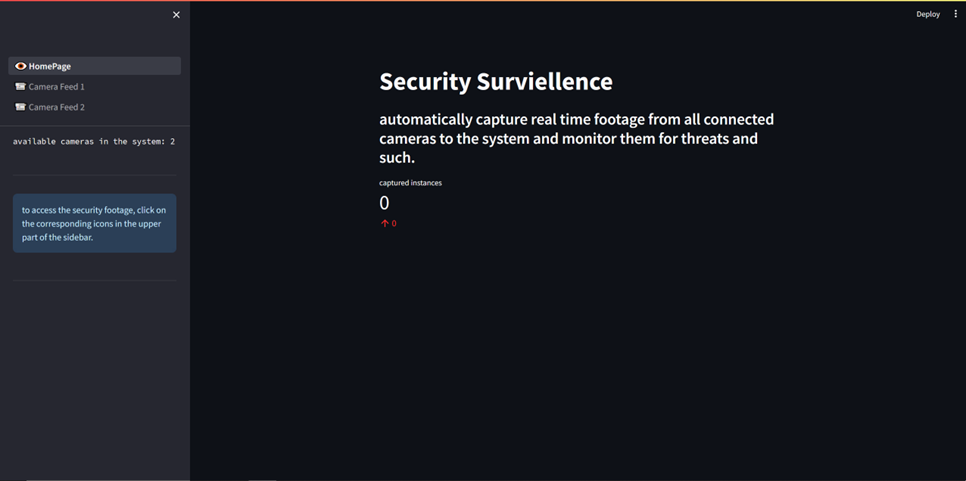
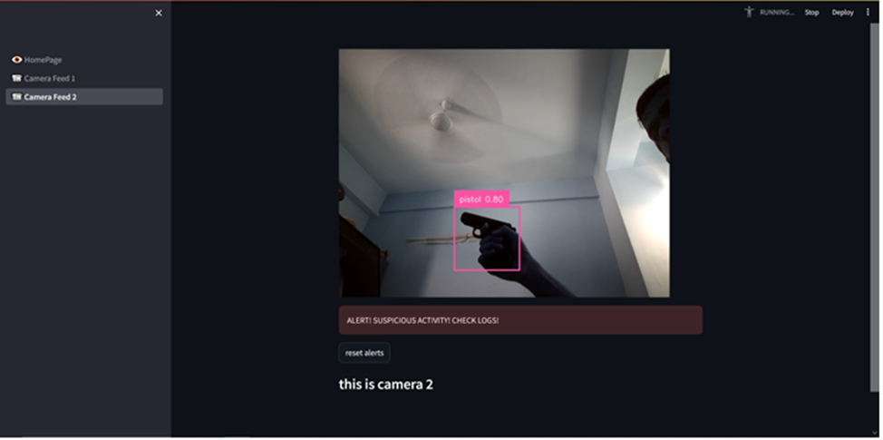

# yolov8 weapon detection (security surviellance) webapp

the model `yolov8sbest.pt` is trained using `roboflow` and `colab` and used here for inference.

the `streamlit` application is launched on the local server and shows available cameras for surviellance.

activate virtual environment with the said dependencies and then run the webapp by `streamlit run app.py` in the main directory.

each camera calls the `process` method from the `base` file and will save images with confidence>0.6 and 5 continuous frames in user directory.

